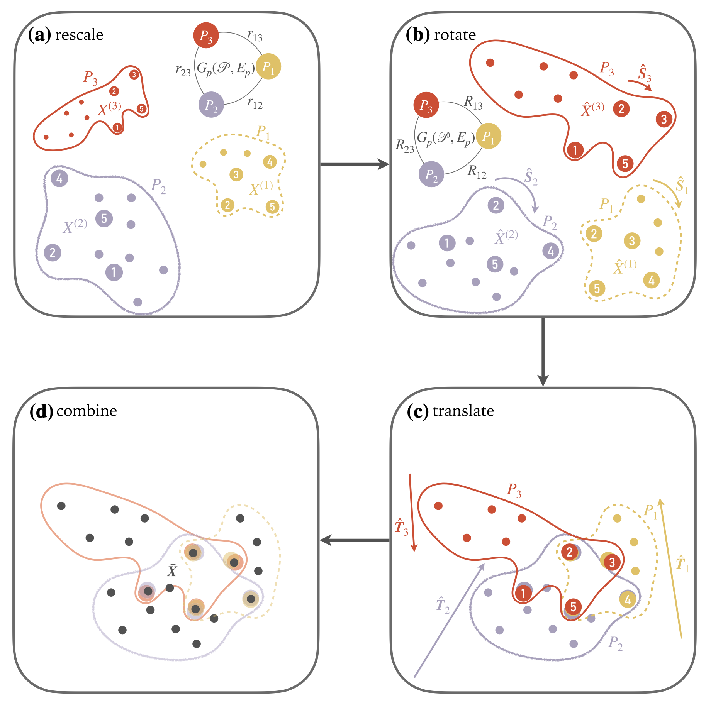

 

# l2gv2 - Local2Global

[**🌐 Documentation**](https://l2gv2.readthedocs.io/en/latest/) |
[**🛠 Development**](https://l2gv2.readthedocs.io/en/latest/development.html)

The `l2gv2` package is a framework for scalable graph
representation learning, implementing algorithms such as the one depicted in

> Jeub, L.G.S., Colavizza, G., Dong, X., Bazzi, M., Cucuringu, M.  
> Local2Global: a distributed approach for scaling representation learning on graphs.
> *Mach Learn* 112, 1663–1692 (2023). https://doi.org/10.1007/s10994-022-06285-7

Traditional centralized graph representation learning methods do not scale well
 to large graphs, which do not fit into memory. The core idea of local2global
algorithms (both the one presented above, and a new algorithm developed in this
package) is to divide a large graph into smaller, overlapping subgraphs --
referred to as *patches* and learn local embeddings independently. These *local*
embeddings are then aligned by learning appropriate transformations between
patches so that the patches can be made to overlap in a shared global embedding.
Alignment takes place by inferring appropriate transformation matrices for
rescaling, rotation and translation as shown in the figure above, adapted from
the Local2Global paper.

This library implements local2global algorithms, allowing patches to be
processed independently. The library includes methods for graph partitioning,
local embedding generation using popular graph neural network (GNN) models such
as Graph AutoEncoders (GAE), and algorithms for global alignment. We
also show the application of the library in correctly estimating global
embeddings for well-known graph neural network models in the literature, such as
the [Cora](https://link.springer.com/article/10.1023/A:1009953814988) dataset of
machine learning citations and the [DGraph](https://arxiv.org/abs/2207.03579)
financial dataset.

## Installation

The package is available on PyPI at TODO

For detailed installation instructions, consult the [documentation](https://l2gv2.readthedocs.io).

## Contributors

The following people contributed to this project ([emoji key](https://allcontributors.org/docs/en/emoji-key)).

This project follows the [all-contributors](https://github.com/all-contributors/all-contributors) specification.